### О себе

Меня зовут Алексей Крайнев. Изучением анализа данных и машинного обучения я занимаюсь с 2018 г. 
С этого же времени я занимаюсь процессами сбора и визуализации данных в организации. 
Для углубления своих знаний прошел несколько онлайн курсов, где изучил Python, Airflow, Tableau,
SQL, теорию вероятностей и математическую статистику, а также классические методы машинного обучения.  
В настоящее время я занимаюсь аналитикой данных в организации, где автоматизирую процессы сбора и 
визуализации данных, строю прогнозы выручки и цен типовых корзин материалов для их выгодной закупки.

###  Контакты

alexeykraynev@gmail.com  
TG: https://t.me/Kraynev_AV

### Сертификаты

* все сертификаты кликабельны

#### Math Statistics basics

<a href="https://stepik.org/cert/194553" target="_blank">
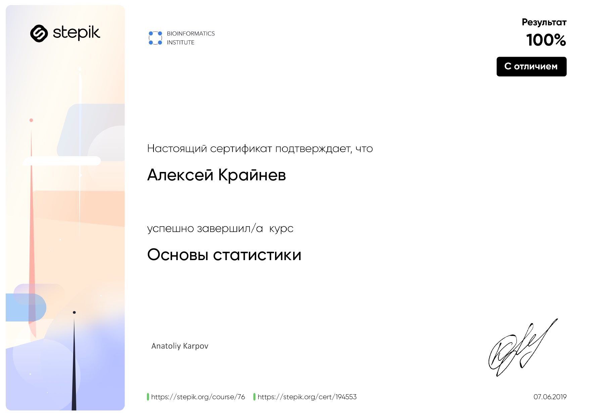
</a>

#### Tableau

<a href="https://www.datacamp.com/statement-of-accomplishment/course/8eb1d7b02a06e3e97061b9c8c9c4a3d6f831c5de" target="_blank">
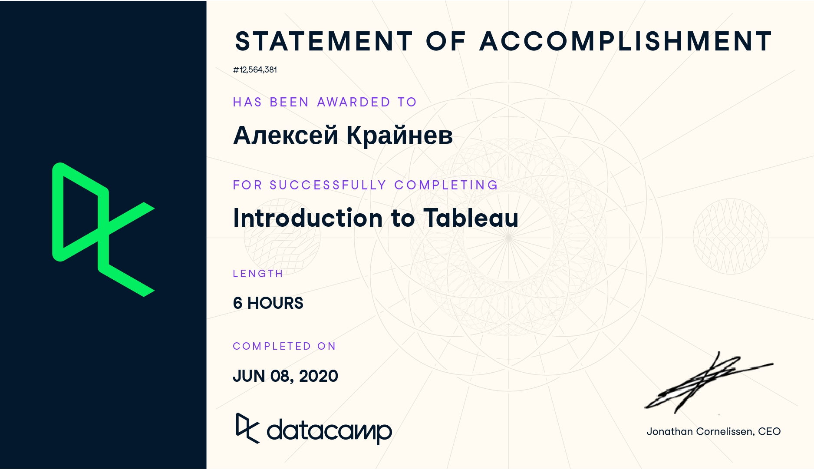
</a>

#### SQL

<a href="https://www.datacamp.com/statement-of-accomplishment/course/dfc342a49c1dcbecd4130a2b3c8de9f498888522" target="_blank">
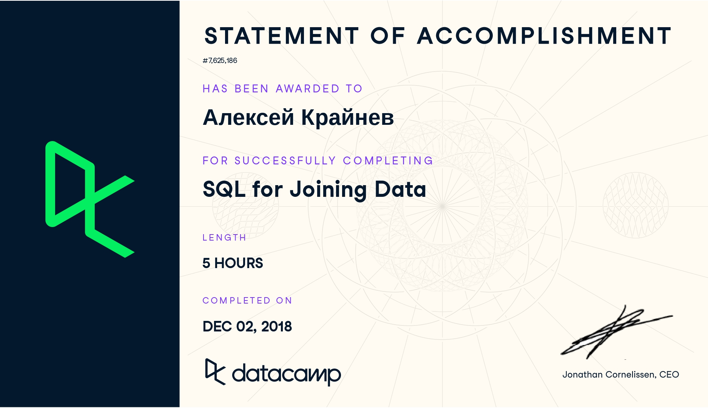
</a>

#### Python

<a href="https://www.datacamp.com/statement-of-accomplishment/course/4e3d6597a65ed9f9efba5b0a7b2ab8dd55cb3993" target="_blank">
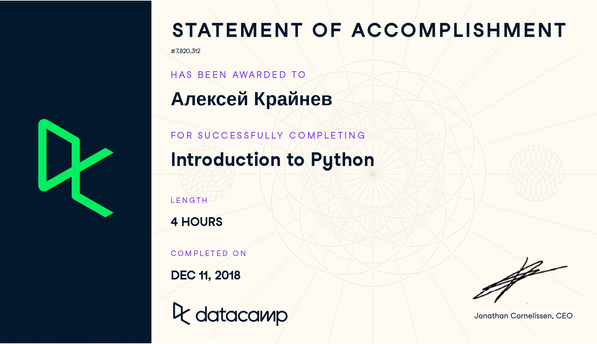
</a>

<a href="https://www.datacamp.com/statement-of-accomplishment/course/d7925cbc22a50e8cb1281384905e785bab1480bc" target="_blank">
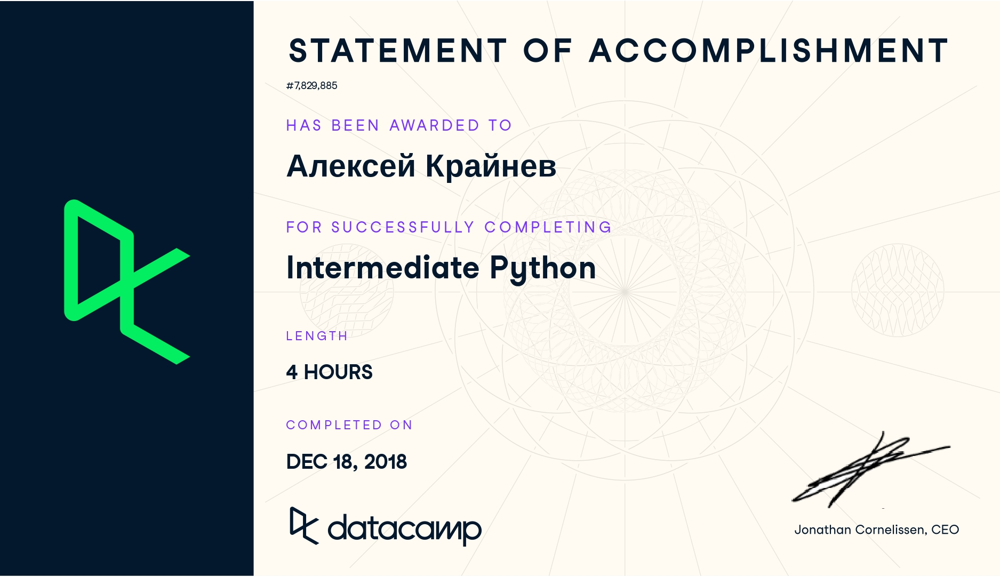
</a>

<a href="https://www.datacamp.com/statement-of-accomplishment/course/094aa2693a7f8165f27d708bba9a013343463e9c" target="_blank">
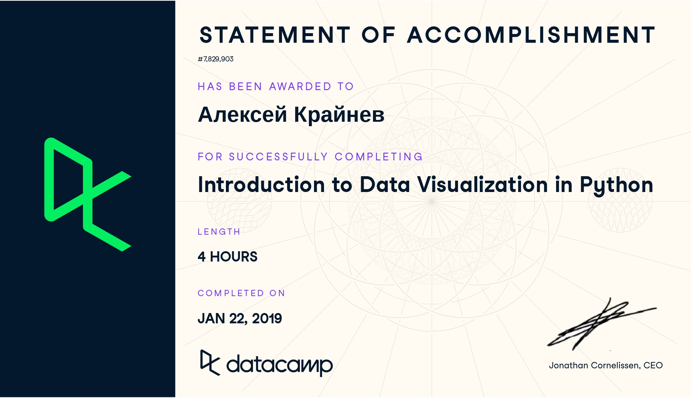
</a>

#### Pandas

<a href="https://www.datacamp.com/statement-of-accomplishment/course/22089c0630b6582670f115c354e28885eb66ffd4" target="_blank">
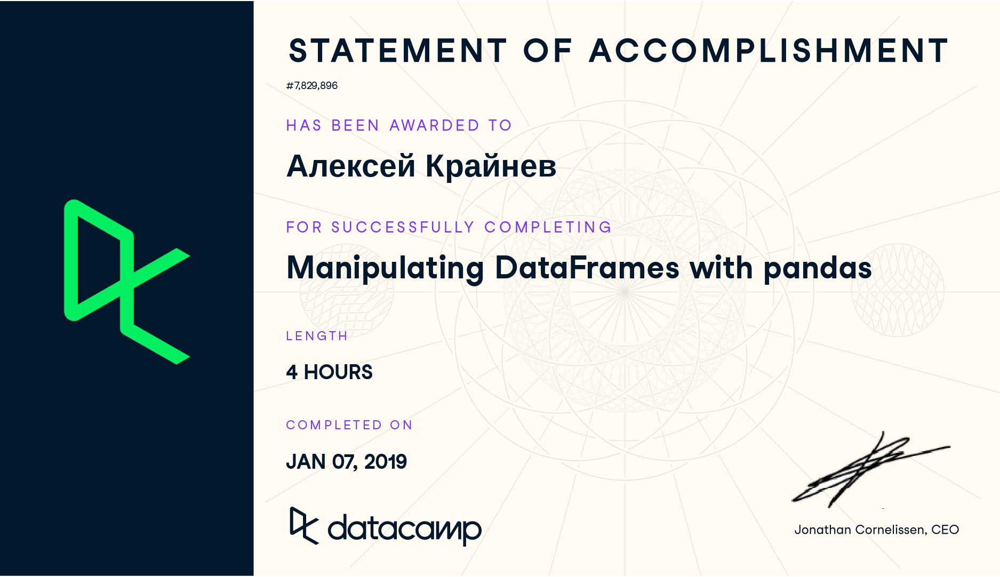
</a>

#### Machine Learning

<a href="https://www.datacamp.com/statement-of-accomplishment/course/462d109d4058b06539d7e3989f56c4b8e8aa6cc5" target="_blank">
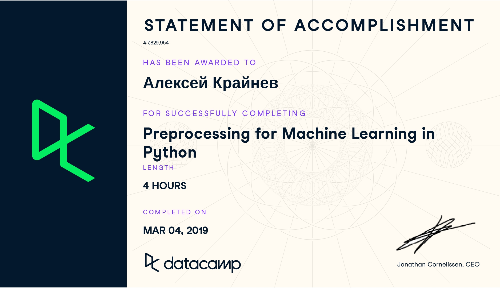
</a>

<a href="https://www.datacamp.com/statement-of-accomplishment/course/e09b127afdac5fde119fa2d747df40cf9e212dc1" target="_blank">
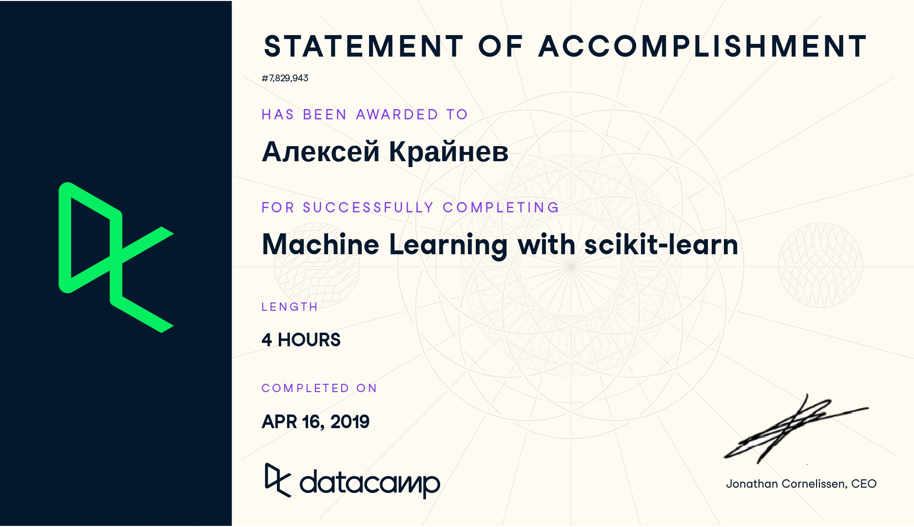
</a>

<a href="https://www.datacamp.com/statement-of-accomplishment/course/5ddfc65742ff7a001dae2cab750c0651ce75beea" target="_blank">
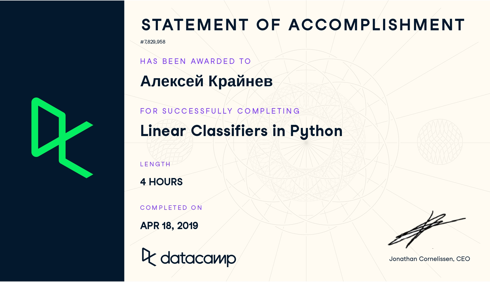
</a>

#### PySpark

<a href="https://www.datacamp.com/statement-of-accomplishment/course/3aae2c5cb4fd4009e315730416b0a19938edf303" target="_blank">
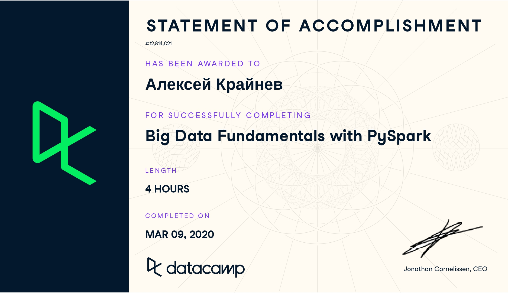
</a>

