### О себе

###  Контакты

alexeykraynev@gmail.com  
TG: @Kraynev_AV

### Сертификаты

<a href="https://lab.karpov.courses/certificate/d99f4a89-78d6-4cdf-869e-82a445ba4071/" target="_blank">
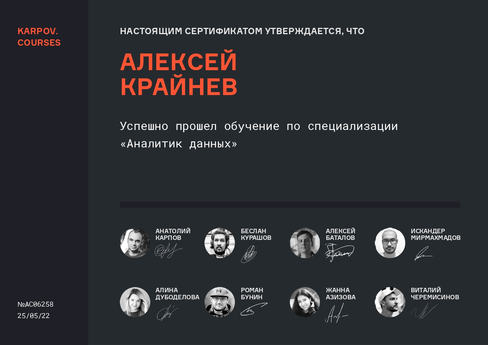
</a>

#### Math Statistics basics

<a href="https://www.datacamp.com/statement-of-accomplishment/course/1ec63ec41762990b94509a1d98a2946774be4834" target="_blank">
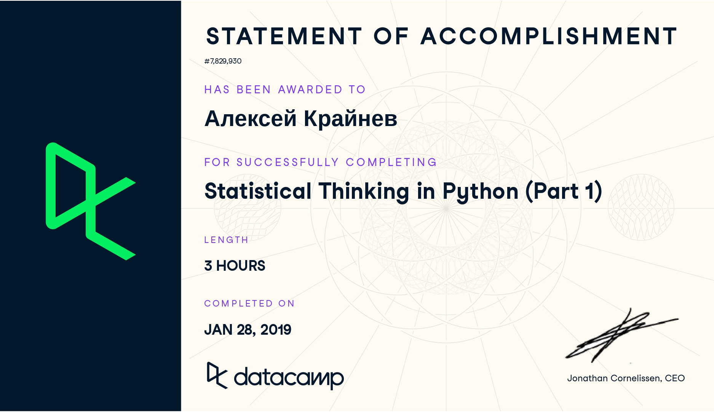
</a>

#### Tableau

<a href="https://www.datacamp.com/statement-of-accomplishment/course/8eb1d7b02a06e3e97061b9c8c9c4a3d6f831c5de" target="_blank">
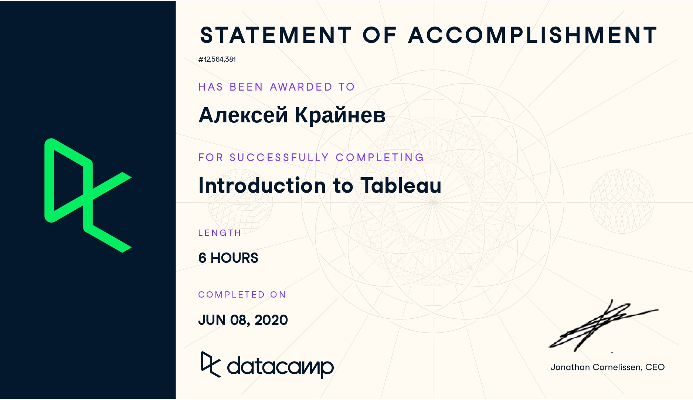
</a>

#### SQL

<a href="https://www.datacamp.com/statement-of-accomplishment/course/dfc342a49c1dcbecd4130a2b3c8de9f498888522" target="_blank">
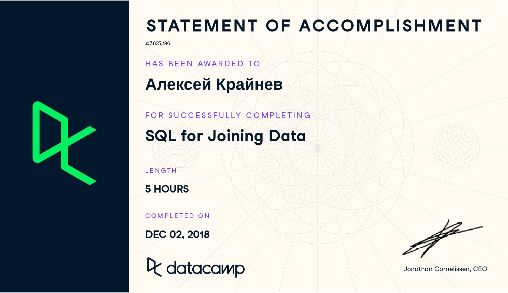
</a>

<a href="https://www.datacamp.com/statement-of-accomplishment/course/dc8319505dfe292e59c77d16e7f2b370df95a0c5" target="_blank">
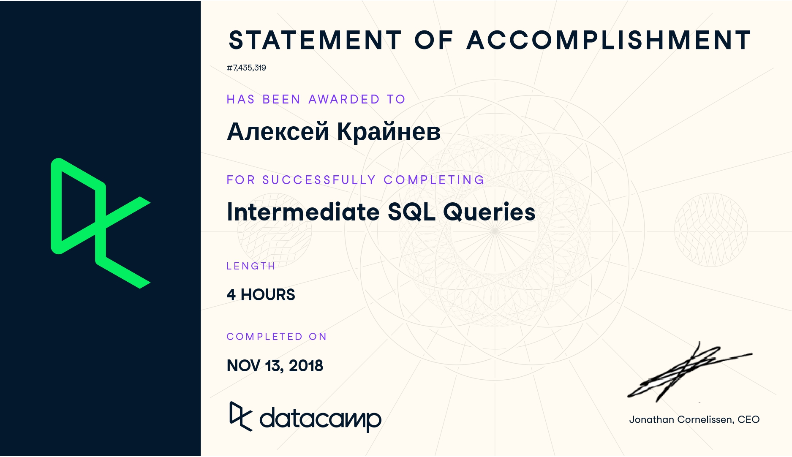
</a>

#### Python

<a href="https://www.datacamp.com/statement-of-accomplishment/course/4e3d6597a65ed9f9efba5b0a7b2ab8dd55cb3993" target="_blank">
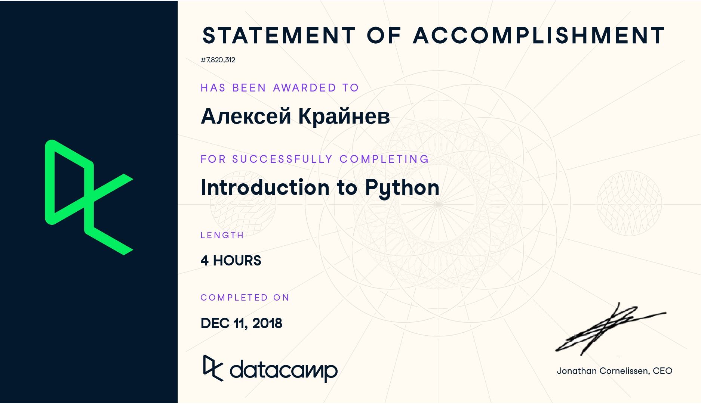
</a>

<a href="https://www.datacamp.com/statement-of-accomplishment/course/d7925cbc22a50e8cb1281384905e785bab1480bc" target="_blank">
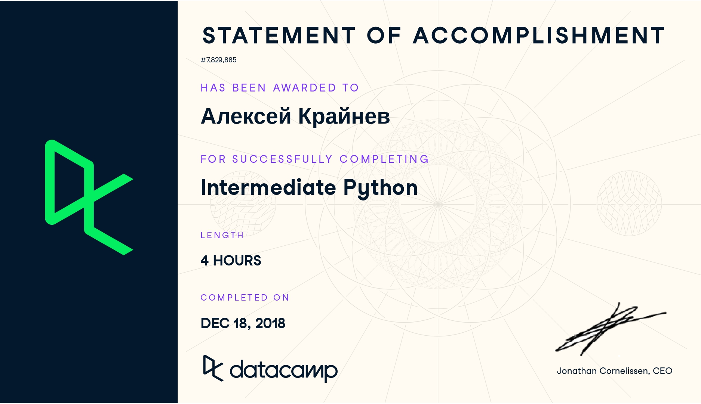
</a>

<a href="https://www.datacamp.com/statement-of-accomplishment/course/094aa2693a7f8165f27d708bba9a013343463e9c" target="_blank">
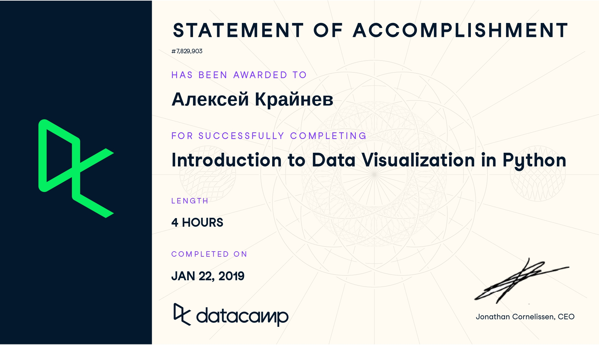
</a>

#### Pandas

<a href="https://www.datacamp.com/statement-of-accomplishment/course/22089c0630b6582670f115c354e28885eb66ffd4" target="_blank">
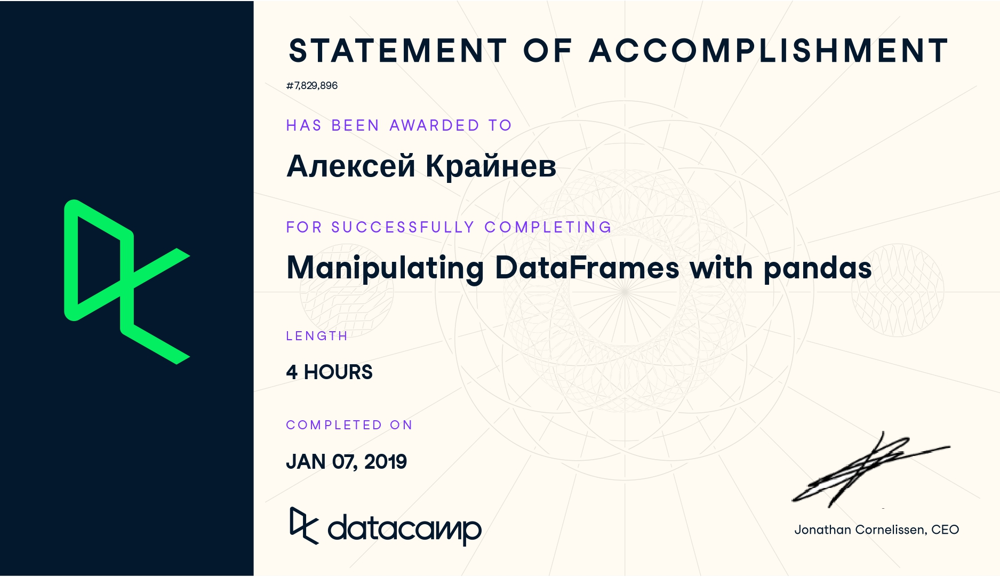
</a>

<a href="https://www.datacamp.com/statement-of-accomplishment/course/cf142e4bf97b43271b7eba83f4bdb40054449624" target="_blank">
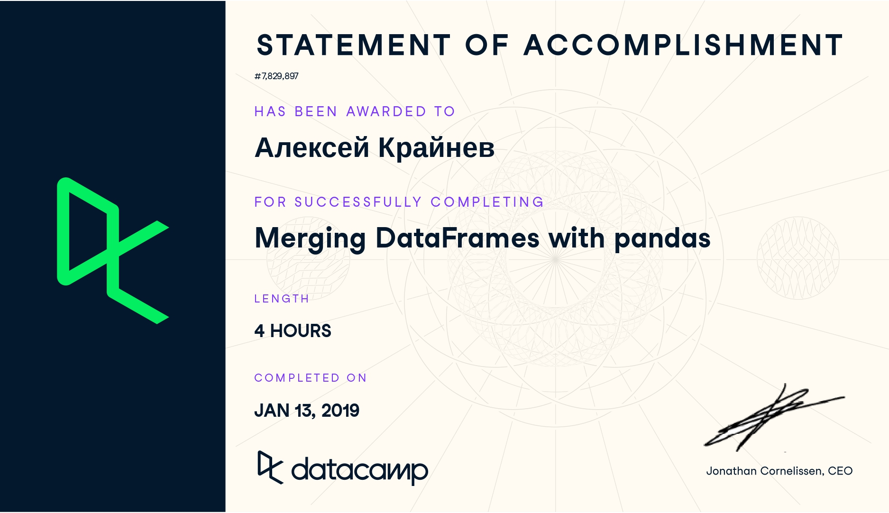
</a>

<a href="https://www.datacamp.com/statement-of-accomplishment/course/6f39afe43c9000b4f31186f623e0fb1439172323" target="_blank">
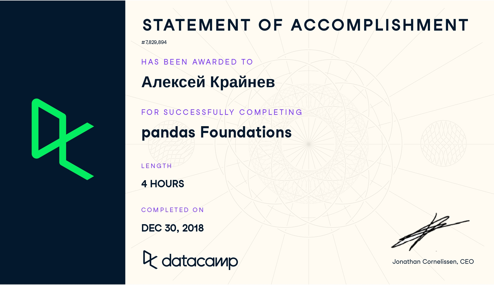
</a>

<a href="https://www.datacamp.com/statement-of-accomplishment/course/d3d56e01970d0669d179ccc0dca84f125918b140" target="_blank">
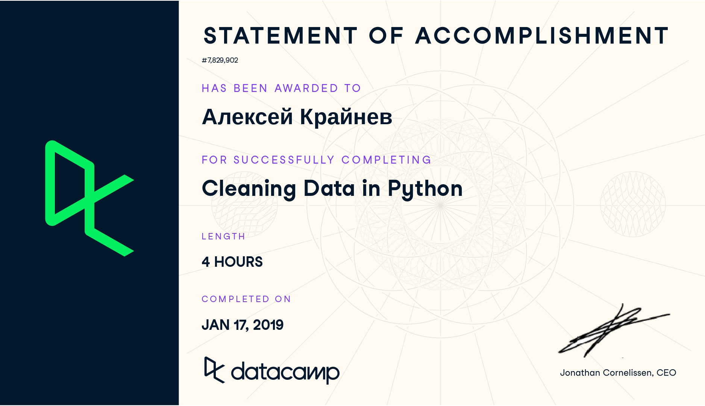
</a>
